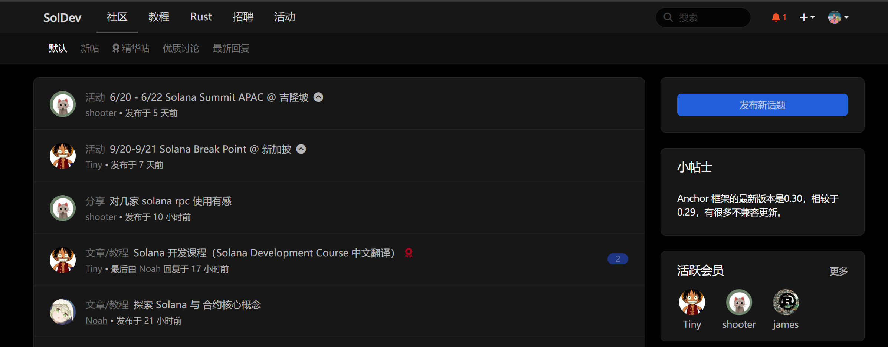

:globe_with_meridians:[English]():globe_with_meridians:	

# Solana教程笔记

用于学习复习`Solana`

来自官方、非官方组织教程的翻译以及学习笔记

未来会将文章部署到网站

## Solana Development Course

### 前言❗

- 官方教程内有许多跑不通或者已经被弃用的代码。

- 所以我在每一节增加了 `注意事项` 标题 ，来记录更改事项与相应需要注意的地方

- 在做实验时请持续关注 `注意事项` 标题来防止浪费时间
- 未来在翻译完毕和代码更新完毕后会直接更新原文中错误内容

### 1 介绍

#### 一、 介绍 

**1.开始：**[代码]() | [教程]() 

### 2 dApp开发

#### 一、加密和 Solana 客户端简介

**1.密码学基础知识：**[代码]() | [教程]() 

**2.从网络读取数据：**[代码]() | [教程]() 

...

### 3 链上程序开发

#### 一、链上程序开发简介

**1.链上程序开发简介：**[代码]() | [教程]() 

**2.本地项目开发：**[代码]() | [教程]() 

#### 二、Anchor程序开发

**1.链上程序开发简介：**[代码]() | [教程]() 

**2.本地项目开发：**[代码]() | [教程]() 

...

## 工具与参考

1. 官方文档

   1. Solana Documention [官网地址](https://solana.com/zh/docs)

   2. Solana Validator Documentation [官网地址](https://docs.solanalabs.com/)

   3. Solana Program Library [官网地址](https://spl.solana.com/)
2. RPC
   1. [Helius - The Developer Platform for Solana](https://dev.helius.xyz/dashboard/app)
   2. [QuickNode - Home](https://dashboard.quicknode.com/)

3. 教程
   1. [solana cookbook](https://solanacookbook.com/zh/)
   2. [Solana Development Course | QuickNode](https://www.quicknode.com/courses/solana/solana-basics/overview)
   3. [Helius Blog | Helius Docs](https://docs.helius.dev/resources/helius-blog)
   4. [Solana Co Learn (creatorsdao.github.io)](https://creatorsdao.github.io/solana-co-learn/)
   5. [SolDev - Solana Development Course](https://www.soldev.app/course)
   6. [solana 中文教程](https://www.solanazh.com/)

5. 资源

   1. TinTinLand solana资源大全 [Solana 开发者资源库 (notion.so)](https://www.notion.so/Solana-fca856aad4e5441f80f28cc4e015ca98)
   1. [SolDev](https://www.soldev.app/)

6. 论坛

   1. solana的stackoverflow[Solana Stack Exchange](https://solana.stackexchange.com/)

   2. solana 开发者论坛 [Solana Developer Forums - Welcome to the Solana Developer Forums](https://forum.solana.com/)

   3. Solana华语技术论坛 [SolDev](https://soldev.cn/)

      

