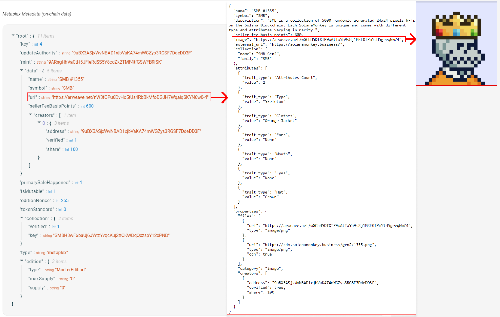

| 目标                                                         |                实验                |
| ------------------------------------------------------------ | :--------------------------------: |
| 1. 分析NFT及其在Solana网络上的表示方式。<br/>2. 分析Metaplex在Solana NFT生态系统中的角色。<br/>3. 使用Metaplex SDK 创建和更新NFT。<br/>4. 分析Token Metadata程序、Candy Machine程序和Sugar CLI的基本功能，这些工具帮助在Solana上创建和分发NFT。 | 铸造 NFT、更新其元数据并与集合关联 |

# [用Metaplex创造Solana NFTs ](https://www.soldev.app/course/nfts-with-metaplex)

## 概述

- **非同质化代币（NFTs）** 在 Solana 上以 SPL 代币的形式呈现，带有关联的元数据账户，0 小数位，最大供应量为 1
- **Metaplex** 提供了一系列工具，简化在 Solana 区块链上创建和分发 NFTs 的过程
- **Token Metadata** 程序标准化了将元数据附加到 SPL 代币的过程
- **Metaplex SDK** 是一个工具，提供了用户友好的 API，帮助开发人员利用 Metaplex 提供的链上工具
- **Candy Machine**程序是一种用于创建和铸造 NFTs 的分发工具，可从集合中创建和铸造 NFTs
- **Sugar CLI** 是一个工具，简化了上传媒体/元数据文件并为集合（collection）创建糖果机的过程

## 课程内容

Solana 的非同质化代币（Non-Fungible Tokens，NFTs）是使用 Token 程序（Token program）创建的 SPL 代币（SPL tokens）。然而，这些代币还有与每个铸币厂相关联的额外元数据账户（metadata account）。这使得代币具有广泛的用途。您可以有效地将任何东西代币化，从游戏库存到艺术品。

在本课程中，我们将介绍 Solana 上 NFTs 的基本表示方式，以及如何使用 Metaplex SDK 创建和更新它们，并简要介绍一些工具，可以帮助您在 Solana 上大规模创建和分发 NFTs。

### Solana 上的 NFTs

Solana 上的 NFT 是一个具有关联元数据的不可分割的代币。此外，该代币的铸造具有最大供应量为 1。

换句话说，一个 NFT 是来自 Token 程序的标准代币，但与您可能认为的 "标准代币" 不同，它：

1. 具有 0 小数位，因此无法再分割
2. 来自供应量为 1 的铸币厂，因此只有一个这样的代币存在
3. 来自授权（authority）设置为 `null` 的铸币厂（以确保供应量永远不会改变）
4. 具有存储元数据的关联账户

虽然前三点是可以通过 SPL Token 程序实现的功能，但关联的元数据需要一些额外的功能。

通常，NFT 的元数据既有链上组件，也有链下组件。请参见下面的图表：



- **链上元数据**（ **onchain metadata**） 存储在与铸币厂相关联的账户中。链上元数据包含一个指向链下 `.json` 文件的 URI 字段。
- **链下元数据**（**off-chain metadata**） 在 JSON 文件中存储了 NFT 的媒体链接（图像、视频、3D 文件）、NFT 可能具有的任何特性以及额外的元数据（参见[此示例 JSON 文件](https://lsc6xffbdvalb5dvymf5gwjpeou7rr2btkoltutn5ij5irlpg3wa.arweave.net/XIXrlKEdQLD0dcML01kvI6n4x0GanLnSbeoT1EVvNuw)）。通常使用像 **Arweave** 这样的永久数据存储系统来存储 NFT 元数据的链下组件。

### **Metaplex**

[Metaplex](https://www.metaplex.com/) 是一个提供一套工具的组织，比如 [Metaplex SDK](https://docs.metaplex.com/sdks/js/)，用于简化在 Solana 区块链上创建和分发 NFT 的过程。这些工具适用于各种用例，并且允许您轻松管理整个 NFT 创建和铸造过程。

具体而言，Metaplex SDK 旨在帮助开发人员利用 Metaplex 提供的链上工具。它提供了一个用户友好的 API，专注于流行的用例，并允许与第三方插件轻松集成。要了解 Metaplex SDK 的功能，请参阅 [README](https://github.com/metaplex-foundation/js#readme)。

Metaplex 提供的重要程序之一是 Token Metadata 程序。Token Metadata 程序标准化了将元数据附加到 SPL Token 的过程。使用 Metaplex 创建 NFT 时，Token Metadata 程序使用 token mint 作为种子，使用程序衍生地址 (PDA)创建一个元数据账户。这样，任何 NFT 的元数据账户都可以通过 token mint 的地址确定性地定位。要了解有关 Token Metadata 程序的更多信息，请参阅 Metaplex [文档](https://docs.metaplex.com/programs/token-metadata/)。

在接下来的几节中，我们将介绍使用 Metaplex SDK 准备资源(assets)、创建 NFT、更新 NFT 以及将 NFT 与更广泛的集合关联的基础知识。

#### Metaplex 实例

一个 `Metaplex` 实例（instance）充当访问 Metaplex SDK API 的入口点。此实例接受用于与群集通信的连接。此外，开发人员可以通过指定 "Identity Driver" 和 "Storage Driver" 自定义 SDK 的交互。

Identity Driver 实际上是一个可以用来签名交易的密钥对，创建 NFT 时需要。Storage Driver 用于指定您要用于上传资产的存储服务。`bundlrStorage` 驱动程序是默认选项，它将资源(assets)上传到 Arweave，一个永久且去中心化的存储服务。

> Bundlr、Arseeding、Arg8是三个Arweave生态中典型的基础设施。Bundlr是一个数据上传服务，Arweave上超过一半的数据都是通过Bundlr上传。
>
> [Bundlr, Arseeding, Arg8 对比 | 登链社区 | 区块链技术社区 (learnblockchain.cn)](https://learnblockchain.cn/article/6344)
>
> Bundlr是搭建在Arweave上的扩展层，类似于L2，现阶段聚焦在为用户提供可靠易用的数据上传服务，增加Arweave网络的吞吐量。
>
> Bundlr主要原理是将多个交易进行捆绑打包在一笔交易中，批量上传到Arweave上，从而有效缓解Arweave网络拥堵，提高网络吞吐率。

以下是如何为 devnet 设置 `Metaplex` 实例的示例。

```tsx
import {
  Metaplex,
  keypairIdentity,
  bundlrStorage,
} from "@metaplex-foundation/js";
import { Connection, clusterApiUrl, Keypair } from "@solana/web3.js";

// 创建与 Solana devnet 网络连接的连接对象
const connection = new Connection(clusterApiUrl("devnet"));

// 生成一个新的钱包密钥对
const wallet = Keypair.generate();

// 使用 Metaplex 框架创建 Metaplex 实例
const metaplex = Metaplex.make(connection)
  // 设置钱包密钥对身份验证
  .use(keypairIdentity(wallet))
  // 设置 Bundlr 存储服务
  .use(
    bundlrStorage({
      address: "https://devnet.bundlr.network", // Bundlr 网络地址
      providerUrl: "https://api.devnet.solana.com", // Solana devnet API 提供者地址
      timeout: 60000, // 超时时间设定为 60 秒
    }),
  );

```

#### 上传资源（assets）

在创建 NFT 之前，您需要准备并上传您计划与 NFT 关联的任何资源。虽然这不一定是一幅图像，但大多数 NFT 都与图像相关联。

准备和上传图像涉及将图像转换为缓存（buffer），使用 `toMetaplexFile` 函数将其转换为 Metaplex 格式，最后将其上传到指定的 Storage Driver。

Metaplex SDK 支持从本地计算机上存在的文件或通过浏览器上传的文件创建新的 Metaplex 文件。您可以通过使用 `fs.readFileSync` 读取图像文件，然后使用 `toMetaplexFile` 将其转换为 Metaplex 文件来实现前者。最后，使用您的 `Metaplex` 实例调用 `storage().upload(file)` 来上传文件。该函数的返回值将是存储图像的 URI。

```tsx
const buffer = fs.readFileSync("/path/to/image.png");
const file = toMetaplexFile(buffer, "image.png");

const imageUri = await metaplex.storage().upload(file);
```

#### 上传元数据（metadata）

在上传图像后，现在是时候使用 `nfts().uploadMetadata` 函数上传链下的 JSON 元数据了。这将返回一个 URI，指向存储 JSON 元数据的位置。

请记住，元数据的链下部分包括像图像 URI 这样的信息，以及附加信息，如 NFT 的名称和描述。虽然你在这个 JSON 对象中可以技术上包括任何你想要的东西，但在大多数情况下，你应该遵循 [NFT 标准](https://docs.metaplex.com/programs/token-metadata/token-standard#the-non-fungible-standard) 以确保与钱包、程序和应用的兼容性。

要创建元数据，使用 SDK 提供的 `uploadMetadata` 方法。此方法接受一个元数据对象，并返回一个指向已上传元数据的 URI。

```tsx
const { uri } = await metaplex.nfts().uploadMetadata({
  name: "My NFT",
  description: "My description",
  image: imageUri,
});
```

#### 创建 NFT

在上传 NFT 的元数据之后，您终于可以在网络上创建 NFT 了。Metaplex SDK 的 `create` 方法允许您以最小的配置创建一个新的 NFT。此方法将为您处理铸造账户、代币账户、元数据账户和主版本账户（master edition account）的创建。提供给此方法的数据将代表 NFT 元数据的链上部分。您可以探索 SDK，查看此方法可选提供的所有其他输入。

```tsx
const { nft } = await metaplex.nfts().create(
  {
    uri: uri,
    name: "My NFT",
    sellerFeeBasisPoints: 0,
  },
  { commitment: "finalized" },
);
```

该方法返回一个包含有关新创建的 NFT 信息的对象。默认情况下，SDK 将 `isMutable` 属性设置为 true，允许对 NFT 的元数据进行更新。但是，您可以选择将 `isMutable` 设置为 false，使 NFT 的元数据不可变。

#### 更新 NFT

如果您将 `isMutable` 设置为 true，您可能会有理由更新您的 NFT 元数据。SDK 的 `update` 方法允许您更新 NFT 元数据的链上和链下部分。要更新链下元数据，您需要重复上一步中上传新图像和元数据 URI 的步骤，然后将新的元数据 URI 提供给此方法。这将更改链上元数据指向的 URI，有效地更新链下元数据。

```tsx
const nft = await metaplex.nfts().findByMint({ mintAddress });

const { response } = await metaplex.nfts().update(
  {
    nftOrSft: nft,
    name: "Updated Name",
    uri: uri,
    sellerFeeBasisPoints: 100,
  },
  { commitment: "finalized" },
);
```

请注意，您在调用 `update` 方法时未被包含的任何字段将保持不变，这是设计上的考虑。

#### 将 NFT 添加到集合

一个[认证的集合（Certified Collection）](https://docs.metaplex.com/programs/token-metadata/certified-collections#introduction)本质是一个 NFT，其他的 NFT 可以归属到这个 NFT 集合中。想象一个大型的 NFT 集合，比如 Solana Monkey Business。如果查看一个单独 NFT 的 [元数据](https://explorer.solana.com/address/C18YQWbfwjpCMeCm2MPGTgfcxGeEDPvNaGpVjwYv33q1/metadata)，您将会看到一个 `collection` 字段，其中包含一个指向 `认证集合` [NFT](https://explorer.solana.com/address/SMBH3wF6baUj6JWtzYvqcKuj2XCKWDqQxzspY12xPND/) 的 `key`。简单来说，属于集合的 NFT 与另一个代表集合本身的 NFT 相关联。

为了将一个 NFT 添加到集合中，首先必须创建 Collection NFT。该过程与之前相同，只是您会在我们的 NFT 元数据中包含一个额外的字段：`isCollection`。这个字段告诉代币程序这个 NFT 是一个 Collection NFT。

```tsx
const { collectionNft } = await metaplex.nfts().create(
  {
    uri: uri,
    name: "My NFT Collection",
    sellerFeeBasisPoints: 0,
    isCollection: true
  },
  { commitment: "finalized" },
);
```

然后，您将集合的铸币厂地址列为新 NFT 中 `collection` 字段的引用。

```tsx
const { nft } = await metaplex.nfts().create(
  {
    uri: uri,
    name: "My NFT",
    sellerFeeBasisPoints: 0,
    collection: collectionNft.mintAddress
  },
  { commitment: "finalized" },
);
```

当您查看您新创建的 NFT 的元数据时，现在应该会看到一个像下面这样的 `collection` 字段：

```JSON
"collection":{
  "verified": false,
  "key": "SMBH3wF6baUj6JWtzYvqcKuj2XCKWDqQxzspY12xPND"
}
```

最后一件事是验证 NFT。这实际上只是将上面的 `verified` 字段设为 true，但这非常重要。这是让消费程序和应用程序知道您的 NFT 实际上是集合的一部分的方式。您可以使用 `verifyCollection` 函数来完成此操作：

```tsx
await metaplex.nfts().verifyCollection({
  mintAddress: nft.address,
  collectionMintAddress: collectionNft.address,
  isSizedCollection: true,
})
```

#### 糖果机（Candy Machine）

当创建和分发大量的 NFT 时，Metaplex 使用他们的 [糖果机（Candy Machine）](https://docs.metaplex.com/programs/candy-machine/overview) 程序和 [Sugar CLI](https://docs.metaplex.com/developer-tools/sugar/) 让这变得非常容易。

糖果机实际上是一个铸造和分发程序，帮助启动 NFT 集合。Sugar 是一个命令行界面，可帮助您创建一个糖果机，准备资产，并批量创建 NFT。上面介绍的为创建一个 NFT 执行的步骤，在一次性创建数千个 NFT 时将非常乏味。糖果机和 Sugar 解决了这个问题，并通过提供一系列保障来确保公平启动。

我们不会深入介绍这些工具，但绝对可以查看 [Metaplex 文档中关于糖果机和 Sugar 如何配合工作的说明](https://docs.metaplex.com/developer-tools/sugar/overview/introduction)。

要探索 Metaplex 提供的完整工具范围，您可以查看 GitHub 上的 [Metaplex 存储库](https://github.com/metaplex-foundation/metaplex)。

> 糖果机文档：[糖果机 - 糖 - 概述 (metaplex.com)](https://developers.metaplex.com/candy-machine/sugar)
>
> 

## 实验

在这个实验中，我们将逐步学习如何使用 Metaplex SDK 创建一个 NFT，然后在创建后更新 NFT 的元数据，最后将 NFT 与一个集合关联起来。到最后，您将对如何使用 Metaplex SDK 在 Solana 上与 NFT 进行交互有一个基本的了解。

### 1. 起步

首先，从 [此存储库](https://github.com/Unboxed-Software/solana-metaplex/tree/starter) 的 `starter` 分支下载起始代码。

该项目包含 `src` 目录中的两个图像，我们将使用它们来创建 NFT。

此外，在 `index.ts` 文件中，您将找到以下代码片段，其中包含我们将要创建和更新的 NFT 的示例数据。

```tsx
interface NftData {
  name: string; // NFT 的名称
  symbol: string; // NFT 的符号
  description: string; // NFT 的描述
  sellerFeeBasisPoints: number; // 卖家费用基点
  imageFile: string; // 图片文件名
}

interface CollectionNftData {
  name: string; // NFT 集合的名称
  symbol: string; // NFT 集合的符号
  description: string; // NFT 集合的描述
  sellerFeeBasisPoints: number; // 卖家费用基点
  imageFile: string; // 图片文件名
  isCollection: boolean; // 是否为集合
  collectionAuthority: Signer; // 集合的权限签名者
}

// 新 NFT 的示例数据
const nftData = {
  name: "Name", // 名称
  symbol: "SYMBOL", // 符号
  description: "Description", // 描述
  sellerFeeBasisPoints: 0, // 卖家费用基点
  imageFile: "solana.png", // 图片文件名
}

// 更新现有 NFT 的示例数据
const updateNftData = {
  name: "Update", // 更新的名称
  symbol: "UPDATE", // 更新的符号
  description: "Update Description", // 更新的描述
  sellerFeeBasisPoints: 100, // 更新的卖家费用基点
  imageFile: "success.png", // 更新的图片文件名
}

async function main() {
  // 创建到集群 API 的新连接
  const connection = new Connection(clusterApiUrl("devnet"));

  // 初始化用户的密钥对
  const user = await initializeKeypair(connection);

  console.log("PublicKey:", user.publicKey.toBase58());
}

```

要安装必要的依赖项，请在命令行中运行 `npm install`。

接下来，通过运行 `npm start` 来执行代码。这将创建一个新的密钥对，将其写入 `.env` 文件，并向该密钥对空投 devnet SOL。

```
Current balance is 0
Airdropping 1 SOL...
New balance is 1
PublicKey: GdLEz23xEonLtbmXdoWGStMst6C9o3kBhb7nf7A1Fp6F
Finished successfully
```

### 2. 设置 Metaplex

在开始创建和更新 NFT 之前，我们需要设置 Metaplex 实例。使用以下内容更新 `main()` 函数：

```tsx
async function main() {
  // 创建到集群 API 的新连接
  const connection = new Connection(clusterApiUrl("devnet"));

  // 为用户初始化密钥对
  const user = await initializeKeypair(connection);

  console.log("PublicKey:", user.publicKey.toBase58());

  // 设置 Metaplex
  const metaplex = Metaplex.make(connection)
    .use(keypairIdentity(user))
    .use(
      bundlrStorage({
        address: "https://devnet.bundlr.network",
        providerUrl: "https://api.devnet.solana.com",
        timeout: 60000,
      }),
    );
}

```

### 3. `uploadMetadata` 辅助函数

接下来，让我们创建一个辅助函数来处理上传图像和元数据的过程，并返回元数据 URI。该函数将以 Metaplex 实例和 NFT 数据作为输入，并返回元数据 URI 作为输出。

```tsx
// 辅助函数：上传图像和元数据
async function uploadMetadata(
  metaplex: Metaplex,
  nftData: NftData,
): Promise<string> {
  // 从文件读取到缓冲区
  const buffer = fs.readFileSync("src/" + nftData.imageFile);

  // 缓冲区转换为 Metaplex 文件格式
  const file = toMetaplexFile(buffer, nftData.imageFile);

  // 上传图像并获取图像 URI
  const imageUri = await metaplex.storage().upload(file);
  console.log("图像 URI:", imageUri);

  // 上传元数据并获取元数据 URI（离链元数据）
  const { uri } = await metaplex.nfts().uploadMetadata({
    name: nftData.name,
    symbol: nftData.symbol,
    description: nftData.description,
    image: imageUri,
  });

  console.log("元数据 URI:", uri);
  return uri;
}

```

此函数将读取图像文件，将其转换为缓冲区，然后上传以获取图像 URI。然后，它将上传 NFT 元数据，其中包括名称、标志（symbol）、描述（description）和图像 URI，并获取元数据 URI。此 URI 是链下元数据。该函数还将记录图像 URI 和元数据 URI 以供参考。

### 4. `createNft` 辅助函数

> 原文标题这里有错误

接下来，让我们创建一个辅助函数来处理创建 NFT。此函数以 Metaplex 实例、元数据 URI 和 NFT 数据作为输入。它使用 SDK 的 `create` 方法来创建 NFT，将元数据 URI、名称、卖方费用（seller fee）和标志作为参数传递。

```tsx
// 辅助函数：创建 NFT
async function createNft(
  metaplex: Metaplex,
  uri: string,
  nftData: NftData,
): Promise<NftWithToken> {
  const { nft } = await metaplex.nfts().create(
    {
      uri: uri, // 元数据 URI
      name: nftData.name,
      sellerFeeBasisPoints: nftData.sellerFeeBasisPoints,
      symbol: nftData.symbol,
    },
    { commitment: "finalized" },
  );

  console.log(
    `Token Mint: https://explorer.solana.com/address/${nft.address.toString()}?cluster=devnet`,
  );

  return nft;
}

```

函数 `createNft` 记录了铸币厂的 URL，并返回一个包含有关新创建的 NFT 的信息的 `nft` 对象。NFT 将铸造到与设置 Metaplex 实例时使用的 Identity Driver 相对应的公钥。

### 5. 创建 NFT

现在我们已经设置了 Metaplex 实例，并创建了用于上传元数据和创建 NFT 的辅助函数，我们可以通过创建一个 NFT 来测试这些函数。在 `main()` 函数中，调用 `uploadMetadata` 函数来上传 NFT 数据并获取元数据的 URI。然后，使用 `createNft` 函数和元数据 URI 来创建一个 NFT。

```tsx
async function main() {
	...

  // 上传 NFT 数据并获取元数据的 URI
  const uri = await uploadMetadata(metaplex, nftData);

  // 使用辅助函数和元数据 URI 创建 NFT
  const nft = await createNft(metaplex, uri, nftData);
}
```

在命令行中运行 `npm start` 来执行 `main` 函数。您应该会看到类似以下的输出：

```tsx
Current balance is 1.770520342
PublicKey: GdLEz23xEonLtbmXdoWGStMst6C9o3kBhb7nf7A1Fp6F
image uri: https://arweave.net/j5HcSX8qttSgJ_ZDLmbuKA7VGUo7ZLX-xODFU4LFYew
metadata uri: https://arweave.net/ac5fwNfRckuVMXiQW_EAHc-xKFCv_9zXJ-1caY08GFE
Token Mint: https://explorer.solana.com/address/QdK4oCUZ1zMroCd4vqndnTH7aPAsr8ApFkVeGYbvsFj?cluster=devnet
Finished successfully
```

随时检查生成的图像和元数据的 URI，并通过访问输出中提供的 URL 在 Solana 浏览器上查看 NFT。

### 6. `updateNftUri` 辅助函数

接下来，让我们创建一个辅助函数来处理更新现有 NFT 的 URI。该函数将以 Metaplex 实例、元数据 URI 和 NFT 的铸币厂地址作为输入。它使用 SDK 的 `findByMint` 方法通过铸币厂地址获取现有的 NFT 数据，然后使用 `update` 方法来更新元数据为新的 URI。最后，它将记录铸币厂的 URL 和交易签名以供参考。

```tsx
// 辅助函数：更新 NFT 元数据 URI
async function updateNftUri(
  metaplex: Metaplex,
  uri: string,
  mintAddress: PublicKey,
) {
  // 使用 Mint 地址获取 NFT 数据
  const nft = await metaplex.nfts().findByMint({ mintAddress });

  // 更新 NFT 元数据
  const { response } = await metaplex.nfts().update(
    {
      nftOrSft: nft,
      uri: uri,
    },
    { commitment: "finalized" },
  );

  console.log(
    `Token Mint: https://explorer.solana.com/address/${nft.address.toString()}?cluster=devnet`,
  );

  console.log(
    `Transaction: https://explorer.solana.com/tx/${response.signature}?cluster=devnet`,
  );
}

```

### 7. 更新 NFT

要更新现有的 NFT，我们首先需要上传 NFT 的新元数据并获取新的 URI。在 `main()` 函数中，再次调用 `uploadMetadata` 函数来上传更新后的 NFT 数据并获取元数据的新 URI。然后，我们可以使用 `updateNftUri` 辅助函数，传入 Metaplex 实例、元数据的新 URI，以及 NFT 的铸币厂地址。`nft.address` 来自 `createNft` 函数的输出。

```tsx
async function main() {
	...

  // 更新 NFT 数据并获取新的元数据 URI
  const updatedUri = await uploadMetadata(metaplex, updateNftData);

  // 更新 NFT 使用辅助函数和新的元数据 URI
  await updateNftUri(metaplex, updatedUri, nft.address);
}
```

在命令行中运行 `npm start` 来执行 `main` 函数。您应该会看到类似以下的额外输出：

```tsx
...
Token Mint: https://explorer.solana.com/address/6R9egtNxbzHr5ksnGqGNHXzKuKSgeXAbcrdRUsR1fkRM?cluster=devnet
Transaction: https://explorer.solana.com/tx/5VkG47iGmECrqD11zbF7psaVqFkA4tz3iZar21cWWbeySd66fTkKg7ni7jiFkLqmeiBM6GzhL1LvNbLh4Jh6ozpU?cluster=devnet
Finished successfully
```

您还可以通过从 `.env` 文件中导入 `PRIVATE_KEY` 来在 Phantom 钱包中查看 NFT。

### 8. 创建 NFT 集合

太棒了，现在您知道如何在 Solana 区块链上创建单个 NFT 并对其进行更新！但是，如何将它添加到一个集合中呢？

首先，让我们创建一个名为 `createCollectionNft` 的辅助函数。请注意，它与 `createNft` 非常相似，但确保 `isCollection` 被设置为 true，并且数据符合集合的要求。

```tsx
/**
 * 创建集合 NFT 的辅助函数
 *
 * @param metaplex 使用的 Metaplex 实例
 * @param uri 元数据的 URI
 * @param data 包含集合 NFT 数据的对象
 * @returns 包含 NFT 和 Token 的对象
 */
async function createCollectionNft(
  metaplex: Metaplex,
  uri: string,
  data: CollectionNftData
): Promise<NftWithToken> {
  const { nft } = await metaplex.nfts().create(
    {
      uri: uri,
      name: data.name,
      sellerFeeBasisPoints: data.sellerFeeBasisPoints,
      symbol: data.symbol,
      isCollection: true,
    },
    { commitment: "finalized" }
  );

  console.log(
    `Collection Mint: https://explorer.solana.com/address/${nft.address.toString()}?cluster=devnet`
  );

  return nft;
}

```

接下来，我们需要为集合创建链下数据。在现有的对 `createNft` 的调用之前，在 `main` 函数中添加以下 `collectionNftData`：

```tsx
const collectionNftData = {
  name: "TestCollectionNFT",
  symbol: "TEST",
  description: "Test Description Collection",
  sellerFeeBasisPoints: 100,
  imageFile: "success.png",
  isCollection: true,
  collectionAuthority: user,
}
```

现在，让我们使用 `collectionNftData` 调用 `uploadMetadata`，然后调用 `createCollectionNft`。再次强调，这些操作都是在创建 NFT 的代码之前进行的。

```tsx
async function main() {
  ...

  // upload data for the collection NFT and get the URI for the metadata
  const collectionUri = await uploadMetadata(metaplex, collectionNftData)

  // create a collection NFT using the helper function and the URI from the metadata
  const collectionNft = await createCollectionNft(
    metaplex,
    collectionUri,
    collectionNftData
  )
}
```

这将返回我们集合的铸币厂地址，因此我们可以使用它来将 NFT 分配给该集合。

### 9. 将 NFT 分配给集合

现在我们有了一个集合，让我们修改现有的代码，以便新创建的 NFT 被添加到集合中。首先，让我们修改我们的 `createNft` 函数，以便在调用 `nfts().create` 时包含 `collection` 字段。然后，添加调用 `verifyCollection` 的代码，以确保链上元数据中的 `verified` 字段被设置为 true。这样消费程序和应用程序就可以确信该 NFT 实际上属于该集合了。

```tsx
async function createNft(
  metaplex: Metaplex,
  uri: string,
  nftData: NftData
): Promise<NftWithToken> {
  const { nft } = await metaplex.nfts().create(
    {
      uri: uri, // metadata URI
      name: nftData.name,
      sellerFeeBasisPoints: nftData.sellerFeeBasisPoints,
      symbol: nftData.symbol,
    },
    { commitment: "finalized" }
  )

  console.log(
    `Token Mint: https://explorer.solana.com/address/${nft.address.toString()}? cluster=devnet`
  )

  // this is what verifies our collection as a Certified Collection
  await metaplex.nfts().verifyCollection({  
    mintAddress: nft.mint.address,
    collectionMintAddress: collectionMint,
    isSizedCollection: true,
  })

  return nft
}
```

现在，运行 `npm start`，看看效果吧！如果您跟随新的 NFT 链接并查看元数据选项卡，您将看到一个名为 `collection` 的字段，其中列出了您铸币厂集合地址。

恭喜！您已成功学会使用 Metaplex SDK 创建、更新和验证 NFT，作为集合的一部分。这就是您需要为几乎任何用例构建自己的集合所需的一切。您可以构建一个 TicketMaster 的竞争对手，改进 Costco 的会员计划，甚至是将学校的学生 ID 系统数字化。可能性是无穷无尽的！

如果您想查看最终解决方案代码，您可以在相同的 [存储库](https://github.com/Unboxed-Software/solana-metaplex/tree/solution) 的 solution 分支中找到它。

## 挑战

为了加深对 Metaplex 工具的理解，请深入研究 Metaplex 文档，并熟悉 Metaplex 提供的各种程序和工具。例如，您可以深入学习糖果机程序，以了解其功能。

一旦您了解了糖果机程序的工作原理，请利用 Sugar CLI 创建一个用于您自己集合的糖果机，以考验您的知识。这种实践经验不仅会加强您对工具的理解，还会提高您对未来有效使用它们的信心。

玩得开心！这将是您首次独立创建的 NFT 集合！通过这个，您将完成第二模块。希望您对这个过程感到满意！欢迎随时 [分享一些快速反馈](https://airtable.com/shrOsyopqYlzvmXSC?prefill_Module=Module%202)，以便我们继续改进课程！

## 完成了实验吗？

将您的代码推送到 GitHub，并[告诉我们您对本课程的看法](https://form.typeform.com/to/IPH0UGz7#answers-lesson=296745ac-503c-4b14-b3a6-b51c5004c165)！


## 注意

1. 这里的labs并不能正常运行，得等我在以前的solana仓库找到解决方案，或者是api已经被修改（这篇教程已经不适用）
2. 当然在我们的代码里给出了对应的解决方案，类似于上一章