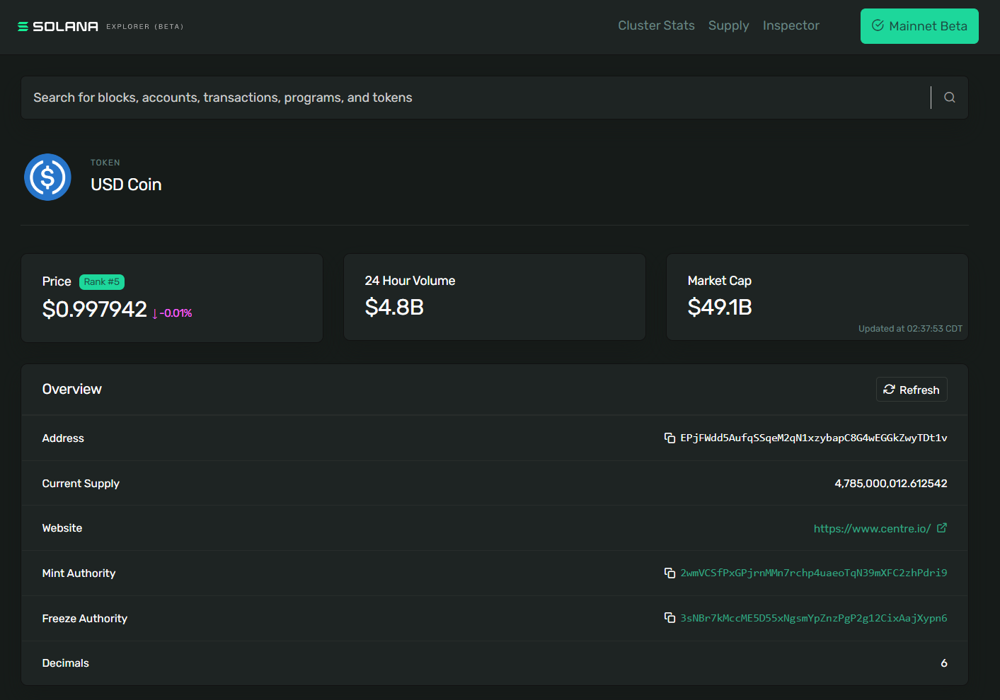
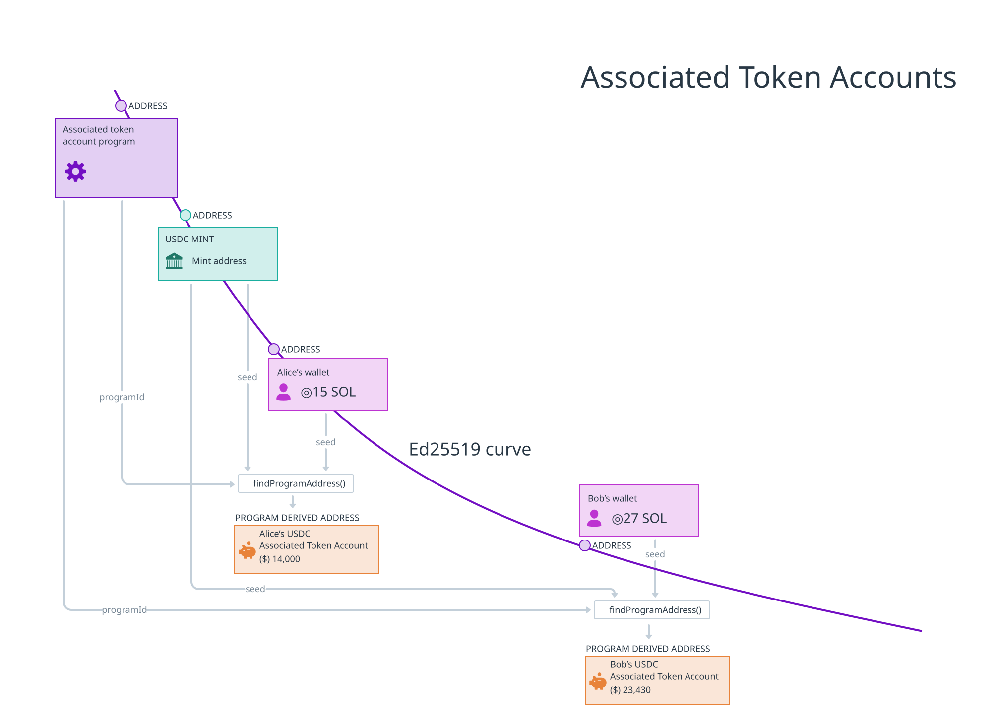
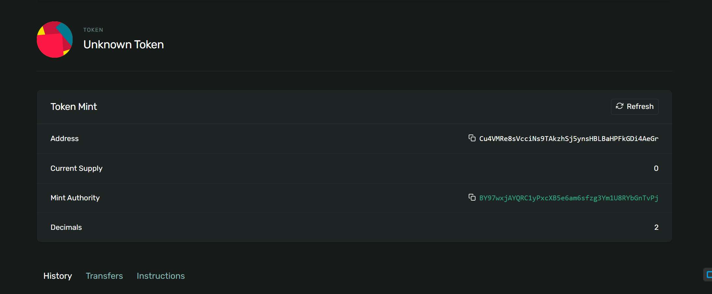
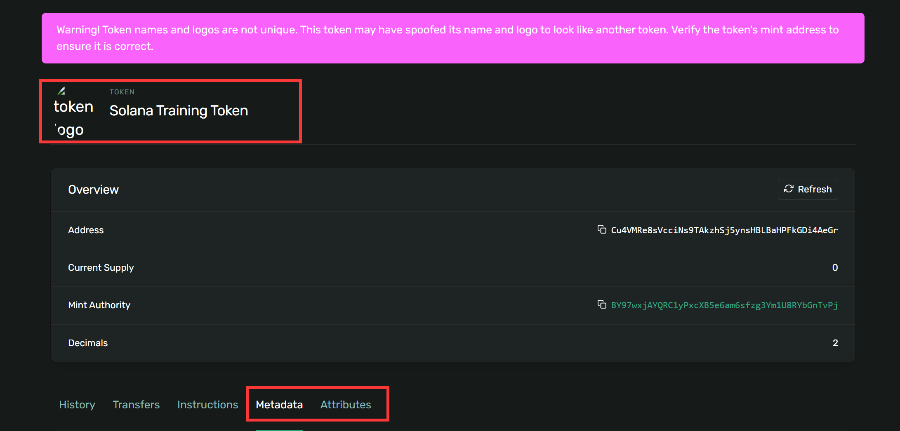
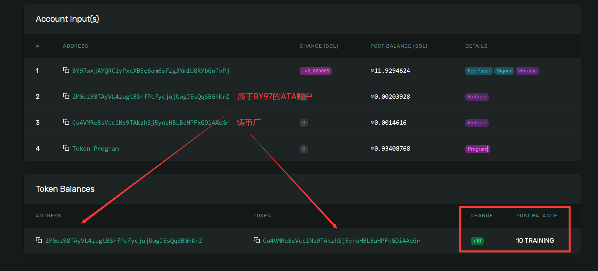
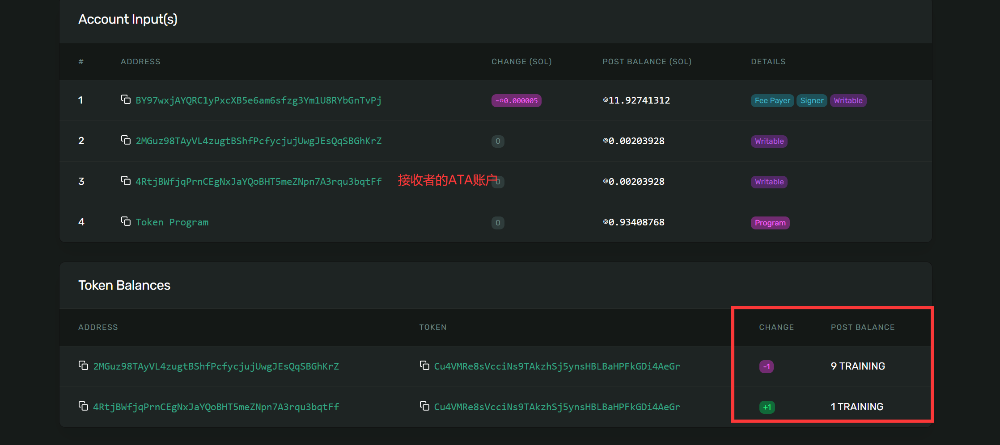
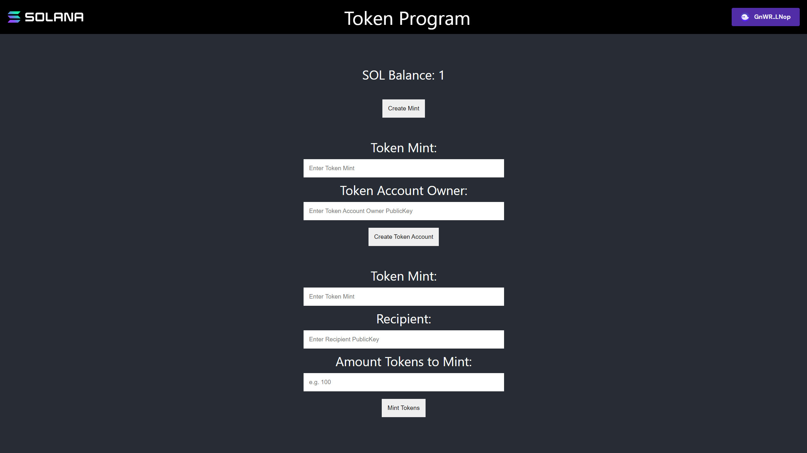

| 目标                                                         |         实验         |
| ------------------------------------------------------------ | :------------------: |
| 1. 创建代币铸币厂<br/>2. 创建代币元数据<br/>3. 创建关联代币账户<br/>4. 铸造代币<br/>5. 转移代币 | 铸造、转让和销毁代币 |

# [用Token Program创建代币](https://www.soldev.app/course/token-program)

## 概述

- 你可能还记得，SOL是Solana的“原生代币”。所有其他的代币，包括同质化和非同质化代币（NFTs），统称为 **SPL代币**。 
- **Token Program **包含了创建和与SPL代币交互的指令。 
- **Token Mints**（铸币厂）是定义特定代币的账户。这包括关于代币本身的信息（比如小数位数），允许铸造更多代币的账户（称为 **mint authority** 铸币权限），以及关于代币的描述、图片等信息的位置。铸币权限可以使用代币铸币厂来生成更多代币！
- **Token Accounts **保存特定铸币厂的代币。对于大多数用户，他们每种代币铸币厂的余额存储在**Associated Token Accounts**（关联代币账户）中——这些账户的地址由他们的钱包地址和代币的铸币厂构成。 
- 创建Token Mints和Token Accounts需要在SOL中分配**租金**（rent）。当Token Account账户关闭时，可以退还租金，但Token Mints账户目前无法关闭。

## 课程内容

代币程序（Token Program）是 Solana 程序库（Solana Program Library，SPL）提供的众多程序之一。它包含了创建和与 SPL-Tokens 交互的指令。这些代币代表了 Solana 网络上的所有非原生（即非 SOL）代币。

本课程将重点介绍使用 Token 程序创建和管理新的 SPL-Token 的基础知识：

1. 创建新的铸币厂
2. 创建代币账户
3. 铸造
4. 将代币从一个持有者转移到另一个持有者
5. 销毁代币

我们将在客户端使用 `@solana/spl-token` Javascript 库来进行开发和讨论。

### 铸币厂（Token Mint）

要创建一个新的 SPL-Token，首先必须创建一个铸币厂（Token Mint）。铸币厂是保存关于特定代币数据的账户。

举个例子，让我们看一下[在 Solana Explorer 上的 USD Coin (USDC)](https://explorer.solana.com/address/EPjFWdd5AufqSSqeM2qN1xzybapC8G4wEGGkZwyTDt1v)。USDC 的铸币厂地址是 `EPjFWdd5AufqSSqeM2qN1xzybapC8G4wEGGkZwyTDt1v`。通过浏览器，我们可以查看有关 USDC 的铸币厂的特定详细信息，例如代币的当前供应量、铸造和冻结权限的地址以及代币的小数精度：



要创建一个新的铸币厂，您需要向 Token 程序发送正确的交易指令。为此，我们将使用 `@solana/spl-token` 中的 `createMint` 函数。

```tsx
const tokenMint = await createMint(
  connection,
  payer,
  mintAuthority,
  freezeAuthority,
  decimal
);
```

`createMint` 函数返回新铸币厂的 `publicKey`。该函数需要以下参数：

- `connection` - 连接到集群的 JSON-RPC 连接
- `payer` - 交易的付款人的公钥
- `mintAuthority` - 授权执行从铸币厂中实际铸造代币的账户。
- `freezeAuthority` - 授权冻结功能的账户，可以冻结相关代币的代币账户。如果不需要冻结功能，则可以将参数设置为 null。
- `decimals` - 指定代币的所需小数精度。

当从具有访问您的私钥的脚本中创建新的铸币厂时，您可以简单地使用 `createMint` 函数。然而，如果您要构建一个网站，允许用户创建新的铸币厂，您需要在不让用户暴露其私钥给浏览器的情况下执行此操作。在这种情况下，您需要构建并提交一个包含正确指令的交易。

在底层，`createMint` 函数实际上是创建一个包含两个指令的交易：

1. 创建一个新的账户
2. 初始化一个新的铸币厂

这看起来如下所示：

```tsx
import * as web3 from '@solana/web3';
import * as token from '@solana/spl-token';

async function buildCreateMintTransaction(
  connection: web3.Connection,        // Solana 网络连接对象
  payer: web3.PublicKey,              // 付款者的公钥
  decimals: number                    // 代币的小数位数
): Promise<web3.Transaction> {        // 异步函数，返回一个 Solana 事务对象
  // 获取创建账户所需的最低 lamports
  const lamports = await token.getMinimumBalanceForRentExemptMint(connection);

  // 生成一个新的账户密钥对
  const accountKeypair = web3.Keypair.generate();

  // 使用 SPL Token 程序的 ID
  const programId = token.TOKEN_PROGRAM_ID;

  // 创建一个 Solana 事务对象
  const transaction = new web3.Transaction().add(
    // 添加创建账户的系统指令
    web3.SystemProgram.createAccount({
      fromPubkey: payer,                      // 指定付款者的公钥
      newAccountPubkey: accountKeypair.publicKey,  // 新账户的公钥
      space: token.MINT_SIZE,                 // 账户的空间大小，这里是铸币的固定大小
      lamports,                               // 分配给账户的 lamports 数量
      programId                               // 账户关联的程序 ID，即 SPL Token 程序的 ID
    }),
    // 添加初始化铸币的指令
    token.createInitializeMintInstruction(
      accountKeypair.publicKey,   // 新铸币的公钥，关联到新创建的账户
      decimals,                   // 指定代币的小数位数
      payer,                      // 付款者的公钥，用于支付费用
      payer,                      // 授权者的公钥，用于授权
      programId                   // SPL Token 程序的 ID
    )
  );

  return transaction;   // 返回构建好的 Solana 事务对象
}

```

当手动构建指令来创建一个新的铸币厂时，请确保将创建账户和初始化铸币厂的指令添加到*同一笔交易*中。如果您将每个步骤分别放在单独的交易中，理论上其他人可能会获取您创建的账户并为其自己的铸造进行初始化。

> 以上和真正封装好的创建铸币厂方法不同，区别如下：
>
> 1. **功能不同**:
>    - `createMint` 方法：创建并初始化一个新的代币（mint），包括创建账户和初始化账户的过程，并最终返回新代币的地址（公钥）。
>    - `buildCreateMintTransaction` 方法：构建一个用于创建新代币的 Solana 事务对象，该事务包括创建账户和初始化铸币的指令，但不执行发送和确认交易的过程，也不返回新代币的地址。
>
> 2. **返回类型不同**:
>    - `createMint` 方法返回一个 `PublicKey`，即新创建的代币的地址。
>    - `buildCreateMintTransaction` 方法返回一个 `web3.Transaction` 对象，该对象包含了创建账户和初始化铸币的指令，但本身并不执行这些操作。
>
> 3. **使用方式不同**:
>    - `createMint` 方法是一个完整的功能函数，它封装了创建和初始化代币账户的完整流程，并最终返回代币的地址，适合直接调用以完成整个操作。
>    - `buildCreateMintTransaction` 方法主要用于构建一个事务对象，该对象可以在需要时与其他操作一起使用，例如发送到区块链网络执行，适合于需要更细粒度控制或者批处理操作的情况。
>
> 4. **功能调用的侧重点不同**:
>    - `createMint` 方法适合于直接调用和执行，将整个创建和初始化过程封装在一个函数中，方便使用者直接获取结果。
>    - `buildCreateMintTransaction` 方法适合于作为构建其他复合操作的一部分，例如在更复杂的交易流程中被调用和组合使用。
>
> 在使用时，根据具体的需求和应用场景选择合适的方法。如果需要完整的创建和初始化代币的功能并获取结果，可以使用 `createMint` 方法；如果只需要构建一个事务对象以备后续操作，可以使用 `buildCreateMintTransaction` 方法。

#### 租金和免租金

注意，在上一个代码片段的函数体的第一行中包含了对 `getMinimumBalanceForRentExemptMint` 的调用，其结果被传递到 `createAccount` 函数中。这是账户初始化的一部分，称为免租金（rent exemption）。

直到最近，Solana 上的所有账户都需要做以下其中一项以避免被回收：

1. 在特定时间间隔支付租金
2. 在初始化时存入足够的 SOL 以被视为免租金

**最近，第一种选项被取消，而变为在初始化新账户时必须存入足够的 SOL 以免租金。**

在这种情况下，我们正在为铸币厂创建一个新账户，因此我们使用 `@solana/spl-token` 库中的 `getMinimumBalanceForRentExemptMint`。然而，这个概念适用于所有账户，对于您可能需要创建的其他账户，您可以在 `Connection` 上使用更通用的 `getMinimumBalanceForRentExemption` 方法。

### 代币账户（Token Account）

在您可以铸造代币（发行新供应量）之前，您需要一个代币账户（token account）来持有新发行的代币。

代币账户持有特定“铸币厂”的代币，并有指定该账户的“所有者（owner）”。只有所有者才能授权减少代币账户余额（转账、销毁等），而任何人都可以向代币账户发送代币以增加其余额。

您可以使用 `spl-token` 库的 `createAccount` 函数来创建新的代币账户：

```tsx
const tokenAccount = await createAccount(
  connection,
  payer,
  mint,
  owner,
  keypair
);
```

`createAccount` 函数返回新代币账户的 `publicKey`。该函数需要以下参数：

- `connection` - 连接到集群的 JSON-RPC 连接
- `payer` - 交易的付款人账户
- `mint` - 新代币账户关联的铸币厂
- `owner` - 新代币账户的所有者账户
- `keypair` - 这是一个可选参数，用于指定新代币账户的地址。如果没有提供 keypair，`createAccount` 函数将默认从关联的 `mint` 和 `owner` 账户派生。

请注意，这里的 `createAccount` 函数与我们在查看 `createMint` 函数底层时上面展示的 `createAccount` 函数是不同的。以前，我们使用 `SystemProgram` 上的 `createAccount` 函数返回创建所有账户的指令。这里的 `createAccount` 函数是 `spl-token` 库中的一个辅助函数，用于提交包含两个指令的事务。第一个指令创建账户，第二个指令将账户初始化为代币账户。

与创建铸币厂一样，如果我们需要手动构建 `createAccount` 的交易，我们可以复制函数在底层所做的操作：

1. 使用 `getMint` 检索与 `mint` 相关联的数据
2. 使用 `getAccountLenForMint` 计算代币账户所需的空间
3. 使用 `getMinimumBalanceForRentExemption` 计算用于免租金的 lamports
4. 使用 `SystemProgram.createAccount` 和 `createInitializeAccountInstruction` 创建一个新的交易。注意，这里的 `createAccount` 来自 `@solana/web3.js`，用于创建一个通用的新账户。`createInitializeAccountInstruction` 使用这个新账户来初始化新的代币账户。

```tsx
import * as web3 from '@solana/web3';
import * as token from '@solana/spl-token';

async function buildCreateMintTransaction(
  connection: web3.Connection,        // Solana 网络连接对象
  payer: web3.PublicKey,              // 付款者的公钥
  decimals: number                    // 代币的小数位数
): Promise<web3.Transaction> {        // 异步函数，返回一个 Solana 事务对象
  // 获取创建账户所需的最低 lamports
  const lamports = await token.getMinimumBalanceForRentExemptMint(connection);

  // 生成一个新的账户密钥对
  const accountKeypair = web3.Keypair.generate();

  // 使用 SPL Token 程序的 ID
  const programId = token.TOKEN_PROGRAM_ID;

  // 创建一个 Solana 事务对象
  const transaction = new web3.Transaction().add(
    // 添加创建账户的系统指令
    web3.SystemProgram.createAccount({
      fromPubkey: payer,                      // 指定付款者的公钥
      newAccountPubkey: accountKeypair.publicKey,  // 新账户的公钥
      space: token.MINT_SIZE,                 // 账户的空间大小，这里是铸币的固定大小
      lamports,                               // 分配给账户的 lamports 数量
      programId                               // 账户关联的程序 ID，即 SPL Token 程序的 ID
    }),
    // 添加初始化铸币的指令
    token.createInitializeMintInstruction(
      accountKeypair.publicKey,   // 新铸币的公钥，关联到新创建的账户
      decimals,                   // 指定代币的小数位数
      payer,                      // 付款者的公钥，用于支付费用
      payer,                      // 授权者的公钥，用于授权
      programId                   // SPL Token 程序的 ID
    )
  );

  return transaction;   // 返回构建好的 Solana 事务对象
}

```

#### 关联代币账户

关联代币账户（Associated Token Account）将代币存储在由以下部分组成的地址中：

- 所有者的公钥（owner's public key）
- 代币的铸币厂地址（token mint）

例如，Bob的USDC代币存储在一个由Bob的公钥和USDC铸币地址构成的关联代币账户中。

关联代币账户提供了一种确定性的方式，来查找一个代币的特定`公钥`所拥有的代币账户。

虽然可以通过其他方式创建代币账户（尤其是对于链上程序），但几乎所有情况下，你希望为用户存储代币时，都会选择关联代币账户。即使用户尚未拥有该代币的关联代币账户，你也可以简单地找到地址并为他们创建该账户。




你可以创建一个关联代币账户,通过使用 `spl-token` 库的 `createAssociatedTokenAccount` 函数。

```tsx
const associatedTokenAccount = await createAssociatedTokenAccount(
  connection,
	payer,
	mint,
	owner,
);
```

这个函数返回新关联代币账户的 `publicKey`，并需要以下参数：

- `connection` - 连接到集群的 JSON-RPC 连接
- `payer` - 交易的付款人账户
- `mint` - 新关联的代币账户所关联的铸币厂
- `owner` - 新关联代币账户的所有者账户

您还可以使用 `getOrCreateAssociatedTokenAccount` 获取与给定地址关联的代币帐户，或者创建它（如果该帐户不存在）。例如，如果您正在编写代码以向给定用户空投代币，则可能会使用此函数来确保创建与给定用户关联的代币帐户（如果该帐户尚不存在）。

在底层，`createAssociatedTokenAccount` 执行两个操作：

1. 使用 `getAssociatedTokenAddress` 从 `mint` 和 `owner` 派生关联代币账户地址
2. 使用 `createAssociatedTokenAccountInstruction` 中的指令构建一个交易

```tsx
import * as web3 from '@solana/web3';
import * as token from '@solana/spl-token';

async function buildCreateAssociatedTokenAccountTransaction(
  payer: web3.PublicKey,    // 付款者的公钥
  mint: web3.PublicKey      // 代币的公钥（mint）
): Promise<web3.Transaction> {  // 异步函数，返回一个 Solana 事务对象
  // 获取关联的代币账户地址
  const associatedTokenAddress = await token.getAssociatedTokenAddress(mint, payer, false);

  // 创建一个 Solana 事务对象
  const transaction = new web3.Transaction().add(
    // 添加创建关联代币账户的指令
    token.createAssociatedTokenAccountInstruction(
      payer,                      // 付款者的公钥，用于支付费用
      associatedTokenAddress,     // 关联代币账户的地址
      payer,                      // 关联账户的所有者的公钥
      mint                        // 代币的公钥（mint）
    )
  );

  return transaction;   // 返回构建好的 Solana 事务对象
}

```

`getOrCreateAssociatedTokenAccount()`的源码：

```tsx
/**
 * 获取或创建关联的代币账户
 *
 * @param connection               使用的连接对象，用于与 Solana 区块链网络通信
 * @param payer                    支付交易和初始化费用的付款者
 * @param mint                     关联账户的代币
 * @param owner                    要设置或验证的账户所有者
 * @param allowOwnerOffCurve       是否允许所有者账户是 PDA（程序派生地址）
 * @param commitment               查询状态时的期望级别
 * @param confirmOptions           确认交易的选项
 * @param programId                SPL Token 程序的账户ID，默认为 TOKEN_PROGRAM_ID
 * @param associatedTokenProgramId SPL 关联代币程序的账户ID，默认为 ASSOCIATED_TOKEN_PROGRAM_ID
 *
 * @return 新关联的代币账户地址
 */
export async function getOrCreateAssociatedTokenAccount(
    connection: Connection,               // 连接对象
    payer: Signer,                        // 付款者，用于支付交易和初始化费用
    mint: PublicKey,                      // 关联的代币的公钥
    owner: PublicKey,                     // 要设置或验证的账户所有者的公钥
    allowOwnerOffCurve = false,           // 是否允许所有者账户是 PDA（程序派生地址），默认为 false
    commitment?: Commitment,              // 查询状态时的期望级别，可选参数
    confirmOptions?: ConfirmOptions,      // 确认交易的选项，可选参数
    programId = TOKEN_PROGRAM_ID,         // SPL Token 程序的账户ID，默认为 TOKEN_PROGRAM_ID
    associatedTokenProgramId = ASSOCIATED_TOKEN_PROGRAM_ID  // SPL 关联代币程序的账户ID，默认为 ASSOCIATED_TOKEN_PROGRAM_ID
): Promise<Account> {
    const associatedToken = getAssociatedTokenAddressSync(  // 获取关联的代币账户地址
        mint,
        owner,
        allowOwnerOffCurve,
        programId,
        associatedTokenProgramId
    );

    // 这是最优的逻辑，考虑到交易费用、客户端计算、RPC 往返以及幂等性保证。
    // 不幸的是我们不能原子化地执行这个逻辑。
    let account: Account;
    try {
        account = await getAccount(connection, associatedToken, commitment, programId);
    } catch (error: unknown) {
        // 如果关联地址已经接收了一些 lamports，成为了系统账户，可能会出现 TokenAccountNotFoundError。
        // 假设程序派生地址是安全的，这种情况下会抛出 TokenInvalidAccountOwnerError。
        if (error instanceof TokenAccountNotFoundError || error instanceof TokenInvalidAccountOwnerError) {
            // 由于这不是原子操作，同时其他人可能会创建关联账户。
            try {
                const transaction = new Transaction().add(
                    createAssociatedTokenAccountInstruction(
                        payer.publicKey,
                        associatedToken,
                        owner,
                        mint,
                        programId,
                        associatedTokenProgramId
                    )
                );

                await sendAndConfirmTransaction(connection, transaction, [payer], confirmOptions);
            } catch (error: unknown) {
                // 忽略所有错误；目前还没有 API 兼容的方式选择性地忽略预期的指令错误，如果关联账户已经存在。
            }

            // 现在应该总是成功
            account = await getAccount(connection, associatedToken, commitment, programId);
        } else {
            throw error;
        }
    }

    // 检查账户的代币和所有者是否正确
    if (!account.mint.equals(mint)) throw new TokenInvalidMintError();
    if (!account.owner.equals(owner)) throw new TokenInvalidOwnerError();

    return account;  // 返回关联的代币账户对象
}

```

### 铸造代币（Mint Tokens）

铸造代币是发行新代币进入流通的过程。当您铸造代币时，您增加了代币铸造的供应量，并将新铸造的代币存入代币账户。只有代币铸币厂的铸币机构（mint authority）才允许铸造新代币。

要使用 `spl-token` 库铸造代币，您可以使用 `mintTo` 函数。

```tsx
const transactionSignature = await mintTo(
  connection,
  payer,
  mint,
  destination,
  authority,
  amount
);
```

`mintTo` 函数返回一个 `TransactionSignature`，可以在 Solana 浏览器上查看。`mintTo` 函数需要以下参数：

- `connection` - 连接到集群的 JSON-RPC 连接
- `payer` - 交易的付款人账户
- `mint` - 新的代币账户关联的铸币厂
- `destination` - 将代币从铸造厂铸造到的代币账户
- `authority` - 被授权铸造代币的账户
- `amount` - 铸造代币的原始数量，不考虑小数，例如，如果 Scrooge Coin 的小数属性设置为 2，则需要将此值设置为 100 才能获得 1 个完整的 Scrooge Coin。

在铸币厂后将铸造权限更新为 null 并不罕见。这会设置一个最大供应量，并确保将来无法再铸造代币。相反，铸造权限可以授予一个程序，以便根据常规间隔或可编程条件自动铸造代币。

在底层，`mintTo` 函数简单地创建一个交易，其中包含从 `createMintToInstruction` 函数获取的指令。

```tsx
import * as web3 from '@solana/web3';
import * as token from '@solana/spl-token';

async function buildMintToTransaction(
  authority: web3.PublicKey,     // 授权者的公钥
  mint: web3.PublicKey,          // 代币的公钥（mint）
  amount: number,                // 铸币的数量
  destination: web3.PublicKey    // 目标账户的公钥
): Promise<web3.Transaction> {   // 异步函数，返回一个 Solana 事务对象
  // 创建一个 Solana 事务对象
  const transaction = new web3.Transaction().add(
    // 添加铸币指令
    token.createMintToInstruction(
      mint,           // 代币的公钥（mint）
      destination,    // 铸币目标账户的公钥
      authority,      // 授权者的公钥，用于授权铸币操作
      amount          // 铸币的数量
    )
  );

  return transaction;   // 返回构建好的 Solana 事务对象
}

```

`mintTo()`的源码：

```tsx
/**
 * 铸造代币到账户
 *
 * @param connection     使用的连接
 * @param payer          支付交易费用的付款者
 * @param mint           要铸币的代币的公钥
 * @param destination    要铸币到的账户的公钥
 * @param authority      铸币权限的账户或多签账户的公钥或签名者
 * @param amount         铸币的数量
 * @param multiSigners   如果 `authority` 是多签账户，则是签名账户数组
 * @param confirmOptions 确认交易的选项
 * @param programId      SPL Token 程序的账户公钥，默认为 TOKEN_PROGRAM_ID
 *
 * @return Promise<TransactionSignature> 确认交易的签名
 */
export async function mintTo(
    connection: Connection,                // 使用的 Solana 连接对象
    payer: Signer,                         // 付款者，支付交易费用
    mint: PublicKey,                       // 要铸币的代币的公钥
    destination: PublicKey,                // 要铸币到的账户的公钥
    authority: Signer | PublicKey,         // 铸币权限的账户或多签账户的公钥或签名者
    amount: number | bigint,               // 铸币的数量
    multiSigners: Signer[] = [],           // 如果 `authority` 是多签账户，则是签名账户数组
    confirmOptions?: ConfirmOptions,       // 确认交易的选项
    programId = TOKEN_PROGRAM_ID           // SPL Token 程序的账户公钥，默认为 TOKEN_PROGRAM_ID
): Promise<TransactionSignature> {
    // 获取签名者和签名数组
    const [authorityPublicKey, signers] = getSigners(authority, multiSigners);

    // 创建一个包含铸币指令的 Solana 事务
    const transaction = new Transaction().add(
        createMintToInstruction(mint, destination, authorityPublicKey, amount, multiSigners, programId)
    );

    // 发送并确认交易
    return await sendAndConfirmTransaction(connection, transaction, [payer, ...signers], confirmOptions);
}

```

### 转移代币（Transfer Tokens）

SPL-Token **转移要求发送方和接收方都必须拥有铸币厂的代币账户。代币从发送方的代币账户转移到接收方的代币账户。**

在获取接收方的关联代币账户时，您可以使用 `getOrCreateAssociatedTokenAccount` 确保其代币账户在转移之前已存在。只需记住，如果该账户尚不存在，此函数将创建该账户，并且交易的付款人将被扣除创建账户所需的 lamports。

一旦您知道接收方的代币账户地址，您可以使用 `spl-token` 库的 `transfer` 函数来转移代币。

```tsx
const transactionSignature = await transfer(
  connection,
  payer,
  source,
  destination,
  owner,
  amount
)
```

`transfer` 函数返回一个 `TransactionSignature`，可以在 Solana Explorer 上查看。`transfer` 函数需要以下参数：

- `connection` - 连接到集群的 JSON-RPC 连接
- `payer` - 交易的付款人账户
- `source` - 发送代币的**代币账户**
- `destination` - 接收代币的**代币账户**
- `owner` - `source` 代币账户的所有者账户
- `amount` - 要转移的代币数量

在底层，`transfer` 函数简单地创建一个交易，其中包含从 `createTransferInstruction` 函数获取的指令：

```tsx
import * as web3 from '@solana/web3';
import * as token from '@solana/spl-token';

async function buildTransferTransaction(
  source: web3.PublicKey,       // 源账户的公钥
  destination: web3.PublicKey,  // 目标账户的公钥
  owner: web3.PublicKey,        // 拥有者的公钥，用于授权转账
  amount: number                // 转账的数量
): Promise<web3.Transaction> {  // 异步函数，返回一个 Solana 事务对象
  // 创建一个 Solana 事务对象
  const transaction = new web3.Transaction().add(
    // 添加转账指令
    token.createTransferInstruction(
      source,         // 源账户的公钥，从该账户转出代币
      destination,    // 目标账户的公钥，接收转入的代币
      owner,          // 拥有者的公钥，用于授权转账操作
      amount          // 转账的数量，即要转移的代币数量
    )
  );

  return transaction;   // 返回构建好的 Solana 事务对象
}

```

`transfer()`的源码：

```tsx
/**
 * 将代币从一个账户转移到另一个账户
 *
 * @param connection     使用的连接对象，用于与 Solana 区块链网络通信
 * @param payer          支付交易费用的付款者
 * @param source         源账户的公钥
 * @param destination    目标账户的公钥
 * @param owner          源账户的所有者的签名者或公钥
 * @param amount         要转移的代币数量，可以是 number 或 bigint 类型
 * @param multiSigners   如果所有者是多重签名，则是签名者的数组
 * @param confirmOptions 用于确认交易的选项，可选
 * @param programId      SPL Token 程序的账户ID，默认为 TOKEN_PROGRAM_ID
 *
 * @return 确认交易的签名
 */
export async function transfer(
    connection: Connection,               // 连接对象
    payer: Signer,                        // 付款者，用于支付交易费用
    source: PublicKey,                    // 源账户的公钥
    destination: PublicKey,               // 目标账户的公钥
    owner: Signer | PublicKey,            // 源账户的所有者，可以是签名者或公钥
    amount: number | bigint,              // 要转移的代币数量，支持 number 或 bigint 类型
    multiSigners: Signer[] = [],          // 多重签名情况下的签名者数组，默认为空数组
    confirmOptions?: ConfirmOptions,      // 确认交易的选项，可选参数
    programId = TOKEN_PROGRAM_ID          // SPL Token 程序的账户ID，默认为 TOKEN_PROGRAM_ID
): Promise<TransactionSignature> {
    const [ownerPublicKey, signers] = getSigners(owner, multiSigners);  // 获取所有者的公钥和签名者数组

    const transaction = new Transaction().add(  // 创建交易对象并添加转账指令
        createTransferInstruction(source, destination, ownerPublicKey, amount, multiSigners, programId)
    );

    return await sendAndConfirmTransaction(connection, transaction, [payer, ...signers], confirmOptions);  // 发送并确认交易
}

```


## 实验

我们将使用代币程序来创建代币铸币厂、创建关联代币账户、铸造代币、转移代币。

> 这里原文有错误

假设您已经有一个 .env 文件，其中按照 [密码学基础](./intro-to-cryptography.md)设置.

```bash
npm i @solana/web3.js @solana/spl-token @solana-developers/helpers esrun
```

### 1.创建铸币厂

创建一个名为 `create-token-mint.ts` 的空文件。加载密钥对后，我们将调用 `createMint()`，将`user`设置为`payer`、`mintAuthority` 和 `freezeAuthority`。

将铸币厂（token mint）想象成制造代币的工厂。我们的用户（user），作为铸币厂的权威（`mintAuthority`），是经营工厂的人。

```tsx
import { createMint } from "@solana/spl-token";
import "dotenv/config";
import {
  getKeypairFromEnvironment,
  getExplorerLink,
} from "@solana-developers/helpers";
import { Connection, clusterApiUrl } from "@solana/web3.js";

const connection = new Connection(clusterApiUrl("devnet"));

const user = getKeypairFromEnvironment("SECRET_KEY");

console.log(
  `🔑 Loaded our keypair securely, using an env file! Our public key is: ${user.publicKey.toBase58()}`
);

// 这是运行以下两个的快捷方式：
// SystemProgram.createAccount
// token.createInitializeMintInstruction
// 参考 https://www.soldev.app/course/token-program
const tokenMint = await createMint(connection, user, user.publicKey, null, 2);

const link = getExplorerLink("address", tokenMint.toString(), "devnet");

console.log(`✅ Finished! Created token mint: ${link}`);
```

下面是`createMint()`的源码

```tsx
/**
 * 创建并初始化一个新的代币
 *
 * @param connection      使用的连接
 * @param payer           交易和初始化费用的支付者
 * @param mintAuthority   控制铸币的账户或多签账户
 * @param freezeAuthority 可选的账户或多签账户，可以冻结代币账户
 * @param decimals        小数点位数
 * @param keypair         可选的密钥对，默认为新生成的随机密钥对
 * @param confirmOptions  确认交易的选项
 * @param programId       SPL Token 程序账户
 *
 * @return 新代币的地址
 */
export async function createMint(
  connection: Connection,                     // Solana 连接实例，用于与区块链网络通信
  payer: Signer,                             // 付款者，用于支付交易和初始化费用
  mintAuthority: PublicKey,                  // 控制铸币的账户或多签账户的公钥
  freezeAuthority: PublicKey | null,         // 可选的账户或多签账户，可以冻结代币账户
  decimals: number,                          // 代币的小数点位数，决定代币的精度
  keypair = Keypair.generate(),              // 可选的密钥对，用于创建新的账户，默认为新生成的随机密钥对
  confirmOptions?: ConfirmOptions,           // 确认交易的选项，例如确认次数、超时等
  programId = TOKEN_PROGRAM_ID               // SPL Token 程序的账户公钥，默认为标准的 SPL Token 程序
): Promise<PublicKey> {
  // 获取创建账户所需的最小免费租金
  const lamports = await getMinimumBalanceForRentExemptMint(connection);

  // 创建一个 Solana 事务对象
  const transaction = new Transaction().add(
    // 添加创建账户的系统指令
    SystemProgram.createAccount({
      fromPubkey: payer.publicKey,           // 付款者的公钥，用于支付交易费用
      newAccountPubkey: keypair.publicKey,   // 新账户的公钥，即将创建的代币账户的公钥
      space: MINT_SIZE,                      // 新账户的空间大小，即账户的最小允许空间
      lamports,                              // 指定的 Lamports，用于初始化账户
      programId,                             // 程序的账户公钥，指定为 SPL Token 程序
    }),
    // 添加初始化代币账户的指令
    createInitializeMint2Instruction(
      keypair.publicKey,        // 新创建的账户的公钥，即代币的地址
      decimals,                 // 代币的小数点位数，决定代币的精度
      mintAuthority,            // 控制铸币的账户或多签账户的公钥
      freezeAuthority,          // 可选的冻结账户的账户或多签账户的公钥，用于冻结代币账户
      programId                 // SPL Token 程序的账户公钥，用于初始化代币账户
    )
  );

  // 发送并确认交易
  await sendAndConfirmTransaction(connection, transaction, [payer, keypair], confirmOptions);

  // 返回新创建的代币账户的公钥，即代币的地址
  return keypair.publicKey;
}

```

使用 `npx esrun create-token-mint.ts` 运行脚本。您应该会看到

```bash
✅ Finished! Created token mint: https://explorer.solana.com/address/HYeUCAqdsQBkqQNHRoBPov42QySDhwM7zAqiorToosbz?cluster=devnet
```

打开 Solana Explorer 并查看您的新代币！



记住铸币厂的地址！我们稍后会用到它。

Cu4VMRe8sVcciNs9TAkzhSj5ynsHBLBaHPFkGDi4AeGr

### 2.创建代币元数据

您会注意到我们的代币帐户没有漂亮的标识，而是在浏览器中显示为“未知代币”。那是因为我们的代币没有元数据！让我们添加一些。

我们将使用版本为2的 Metaplex `mpl-token-metadata` Program 。这是最流行的 `mpl-token-metadata` 版本，与较新的版本 3 相比，降低了显著的复杂性。

```bash
npm i @metaplex-foundation/mpl-token-metadata@2
```

创建一个名为 `create-token-metadata.ts` 的新文件

```tsx
import dotenv from 'dotenv';
dotenv.config();
import {
    getKeypairFromEnvironment,
    getExplorerLink,
} from "@solana-developers/helpers";
import {
    Connection,
    PublicKey,
    Transaction,
    sendAndConfirmTransaction,
} from "@solana/web3.js";
import { createCreateMetadataAccountV3Instruction } from "@metaplex-foundation/mpl-token-metadata";  // 使用 Metaplex 创建元数据账户的函数

// 从环境变量中安全加载用户的密钥对
const user = getKeypairFromEnvironment("SECRET_KEY");

let DEVNET_RPC = process.env.DEVNET_RPC || ''
const connection = new Connection(DEVNET_RPC, "confirmed");

console.log(
    `🔑 We've loaded our keypair securely, using an env file! Our public key is: ${user.publicKey.toBase58()}`
);

// Token Metadata 程序的 ID
const TOKEN_METADATA_PROGRAM_ID = new PublicKey(
    "metaqbxxUerdq28cj1RbAWkYQm3ybzjb6a8bt518x1s"
);

// 替换成您的特定代币铸造账户地址
// const tokenMintAccount = new PublicKey("YOUR_TOKEN_MINT_ADDRESS_HERE");
const tokenMintAccount = new PublicKey("Cu4VMRe8sVcciNs9TAkzhSj5ynsHBLBaHPFkGDi4AeGr");

// 元数据信息
const metadataData = {
    name: "Solana Training Token",  // 代币名称
    symbol: "TRAINING",  // 代币符号
    // 使用 Metaplex 标准的链外数据链接（Arweave / IPFS / Pinata 等）//必须浏览器显示为json形式的链接
    uri: "https://ipfs.io/ipfs/QmeSjSinHpPnmXmspMjwiXyN6zS4E9zccariGR3jxcaWtq/1",  // 元数据链接
    sellerFeeBasisPoints: 0,  // 卖家手续费基点
    creators: null,  // 创建者列表
    collection: null,  // 收藏品信息
    uses: null,  // 使用说明
};

// 查找元数据的程序派生地址（PDA）及其增量
const metadataPDAAndBump = PublicKey.findProgramAddressSync(
    [
        Buffer.from("metadata"),  // 元数据标识
        TOKEN_METADATA_PROGRAM_ID.toBuffer(),  // Token Metadata 程序 ID
        tokenMintAccount.toBuffer(),  // 代币铸造账户地址
    ],
    TOKEN_METADATA_PROGRAM_ID
);

const metadataPDA = metadataPDAAndBump[0];  // 元数据的程序派生地址

// 创建一个新的 Solana 交易
const transaction = new Transaction();

// 添加创建元数据账户的指令，使用 Metaplex
const createMetadataAccountInstruction =
    createCreateMetadataAccountV3Instruction(
        {
            metadata: metadataPDA,  // 元数据地址
            mint: tokenMintAccount,  // 代币铸造账户地址
            mintAuthority: user.publicKey,  // 代币铸造权限的公钥
            payer: user.publicKey,  // 付款者的公钥
            updateAuthority: user.publicKey,  // 更新权限的公钥
        },
        {
            createMetadataAccountArgsV3: {
                collectionDetails: null,  // 收藏品详细信息
                data: metadataData,  // 元数据的数据信息
                isMutable: true,  // 是否可变
            },
        }
    );

transaction.add(createMetadataAccountInstruction);  // 将创建元数据账户的指令添加到交易中

// 发送并确认在 Solana 网络上的交易
const transactionSignature = await sendAndConfirmTransaction(
    connection,
    transaction,
    [user]  // 使用者的密钥对列表
);

// 获取交易的区块链浏览器链接
const transactionLink = getExplorerLink(
    "transaction",
    transactionSignature,
    "devnet"
);

console.log(`✅ Transaction confirmed, explorer link is: ${transactionLink}!`);

// 获取代币铸造地址的区块链浏览器链接
const tokenMintLink = getExplorerLink(
    "address",
    tokenMintAccount.toString(),
    "devnet"
);

console.log(`✅ Look at the token mint again: ${tokenMintLink}!`);

```

使用 `npx esrun create-token-metadata.ts` 运行脚本。

您现在将看到 Solana Explorer 已更新，在铸币厂上显示代币的名称和符号！



请注意，Solana Explorer 将显示如下警告：

> *Warning! Token names and logos are not unique. This token may have spoofed its name and logo to look like another token. Verify the token's mint address to ensure it is correct.*
>
> *警告！代币名称和徽标不是唯一的。此代币可能伪装了它的名称和徽标，使其看起来像另一个代币。验证代币的铸币地址以确保其正确无误。*

这个警告是准确的 - 事实上，任何人都可以使任何代币具有他们喜欢的任何符号或名称。但是，供您参考，如果您正在制作一个非常知名的原始代币，Solana Explorer 会使用基于统一代币列表 API 的白名单。

### 3.创建一个ATA账户来存储代币

现在我们已经创建了铸币厂，让我们创建一个新的关联代币账户（ Associated Token Account），以便某人可以存储我们的代币。这个关联代币账户可以是我们的钱包（如果作为铸币厂的管理者（mint authority），我们想要向我们自己的地址铸造代币），或者是我们认识的任何其他人的devnet钱包！

首先创建一个名为 `create-token-account.ts` 的空文件。然后使用 `getOrCreateAssociatedTokenAccount()` 方法基于钱包和我们的铸币地址来获取一个关联代币账户，并在需要时创建该账户。

记得在下面的代码中替换你的铸币地址！

```tsx
import { getOrCreateAssociatedTokenAccount } from "@solana/spl-token";
import dotenv from 'dotenv';
dotenv.config();
import {
    getExplorerLink,
    getKeypairFromEnvironment,
} from "@solana-developers/helpers";
import { Connection, PublicKey } from "@solana/web3.js";

let DEVNET_RPC = process.env.DEVNET_RPC || ''
const connection = new Connection(DEVNET_RPC, "confirmed");
const user = getKeypairFromEnvironment("SECRET_KEY");

console.log(
    `🔑 Loaded our keypair securely, using an env file! Our public key is: ${user.publicKey.toBase58()}`
);

// 替换为您的代币铸造账户
const tokenMintAccount = new PublicKey(
    "Cu4VMRe8sVcciNs9TAkzhSj5ynsHBLBaHPFkGDi4AeGr"
);

// 在此我们为自己的地址创建关联代币账户，但我们也可以在devnet上为任何其他钱包创建ATA！
// const recipient = new PublicKey("SOMEONE_ELSES_DEVNET_ADDRESS");
const recipient = user.publicKey;

const tokenAccount = await getOrCreateAssociatedTokenAccount(
    connection,
    user,
    tokenMintAccount,
    recipient
);

console.log(`Token Account: ${tokenAccount.address.toBase58()}`);

const link = getExplorerLink(
    "address",
    tokenAccount.address.toBase58(),
    "devnet"
);

console.log(`✅ Created token Account: ${link}`);

```

使用 `npx esrun create-token-account.ts` 运行脚本。您应该看到：

> 这里原文有错误

```bash
✅ Success! Created token account: https://explorer.solana.com/address/CTjoLdEeK8rk4YWYW9ZqACyjHexbYKH3hEoagHxLVEFs?cluster=devnet
```

在 Solana Explorer 中打开代币账户。看看所有者owner - 这是您为其创建 ATA 的帐户！余额将为零，因为我们还没有向那里发送任何代币。让我们向那里铸造一些代币并解决这个问题！

2MGuz98TAyVL4zugtBShfPcfycjujUwgJEsQqSBGhKrZ

### 4.铸造代币

现在我们有了一个铸币厂和一个代币账户，让我们向这个代币账户铸造代币。回想一下，我们将用（user）户设置为我们创建的铸币厂（mint）的铸造权限地址（mintAuthority）。

创建一个名为 `mint-tokens.ts` 的新文件，使用 `spl-token` 的 `mintTo` 函数来铸造代币：

> 这里原文有错误

```tsx
import { mintTo } from "@solana/spl-token";
import dotenv from 'dotenv';
dotenv.config();
import {
    getExplorerLink,
    getKeypairFromEnvironment,
} from "@solana-developers/helpers";
import { Connection, PublicKey } from "@solana/web3.js";

let DEVNET_RPC = process.env.DEVNET_RPC || ''
const connection = new Connection(DEVNET_RPC, "confirmed");

// 我们的代币有两位小数
const MINOR_UNITS_PER_MAJOR_UNITS = Math.pow(10, 2);

const user = getKeypairFromEnvironment("SECRET_KEY");

// 替换为您的代币铸造账户（从 create-token-mint.ts 获取）
const tokenMintAccount = new PublicKey(
    "Cu4VMRe8sVcciNs9TAkzhSj5ynsHBLBaHPFkGDi4AeGr"
);

// 根据之前步骤替换为您自己或朋友的代币账户地址
//这里我们用自己的，也就是（从 create-token-account.ts 获取）
const recipientAssociatedTokenAccount = new PublicKey(
    "2MGuz98TAyVL4zugtBShfPcfycjujUwgJEsQqSBGhKrZ"
);

const transactionSignature = await mintTo(
    connection,
    user,
    tokenMintAccount,
    recipientAssociatedTokenAccount,
    user,
    10 * MINOR_UNITS_PER_MAJOR_UNITS  // 铸币的数量，以最小单位表示
);

const link = getExplorerLink("transaction", transactionSignature, "devnet");

console.log(`✅ Success! Mint Token Transaction: ${link}`);

```

运行 `npx esrun mint-tokens.ts` 来运行脚本。您应该看到：

```bash
✅ Success! Mint Token Transaction:https://explorer.solana.com/tx/h7HMXayLUardYxapdzHLeNQ59nvhxeESDwiTMbmR8nWMk92Ux6rgpAo1H2jKk4QChDEZXJpkB6rK5JyjbFfwntW?cluster=devnet
```

打开浏览器，查看交易和收款人账户中的新代币！



### 5.转移代币

接下来，让我们使用 `spl-token` 库的 `transfer` 函数转移我们刚刚铸造的一些代币。如果你愿意，可以在开发网络上添加第二个账户，或者找一个有开发网络账户的朋友，把你的代币发送给他们！

正如你在浏览器中看到的那样，这些代币当前存储在附加到我们钱包的关联代币账户中。我们不必记住关联代币账户的地址 - 我们可以使用 `getOrCreateAssociatedTokenAccount()` 函数来查找它，提供我们的地址和我们想发送的代币的铸币厂。同样，我们也可以找到（或创建）一个给我们的收件人用来保存这种代币的关联代币账户。

创建一个名为 `send-spl-tokens.ts` 的新文件，使用 `spl-token` 的 `transfer` 函数来铸造代币：

> 这里原文有错误

```tsx
import dotenv from 'dotenv';
dotenv.config();
import {
    getExplorerLink,
    getKeypairFromEnvironment,
} from "@solana-developers/helpers";
import { Connection, PublicKey, clusterApiUrl } from "@solana/web3.js";
import { getOrCreateAssociatedTokenAccount, transfer } from "@solana/spl-token";

let DEVNET_RPC = process.env.DEVNET_RPC || ''
const connection = new Connection(DEVNET_RPC, "confirmed");

const sender = getKeypairFromEnvironment("SECRET_KEY");

console.log(
    `🔑 Loaded our keypair securely, using an env file! Our public key is: ${sender.publicKey.toBase58()}`
);

// 添加接收者的公钥
const recipient = new PublicKey("HekxQd1SGHP33Pg8y2u1SVM3iE39mDnj5kBJQN3c7hX3");

// 替换你的代币铸币账户地址
const tokenMintAccount = new PublicKey("Cu4VMRe8sVcciNs9TAkzhSj5ynsHBLBaHPFkGDi4AeGr");

// 我们的代币有两位小数
const MINOR_UNITS_PER_MAJOR_UNITS = Math.pow(10, 2);

console.log(`💸 Attempting to send 1 token to ${recipient.toBase58()}...`);

// 获取源ATA账户（刚刚 mint-token.ts 的mint目标地址）来准备发送
const sourceTokenAccount = await getOrCreateAssociatedTokenAccount(
    connection,
    sender,
    tokenMintAccount,
    sender.publicKey
);
// 获取或创建目标ATA账户来存储这个代币
const destinationTokenAccount = await getOrCreateAssociatedTokenAccount(
    connection,
    sender,
    tokenMintAccount,
    recipient
);

// 转移代币
const signature = await transfer(
    connection,
    sender,
    sourceTokenAccount.address,
    destinationTokenAccount.address,
    sender,
    1 * MINOR_UNITS_PER_MAJOR_UNITS
);

const explorerLink = getExplorerLink("transaction", signature, "devnet");

console.log(`✅ Transaction confirmed, explorer link is: ${explorerLink}!`);

```

运行 `npx esrun send-spl-tokens.ts` 来运行脚本。您应该看到：

```bash
https://explorer.solana.com/tx/3AMbyyiBd8PewKomVomwsj6QeZMHCk2e4PNLEnAmvTJGzT2AenekJNBMDhUuY6NKzU82LaVZpTLFzb3LUU66i9yc?cluster=devnet
```

打开浏览器链接。你看到你的余额下降了，而收件人的相应代币余额上升了！



## 挑战

现在轮到你独立构建一个项目了。创建一个应用程序，允许用户创建一个新的铸币厂（mint）、创建一个代币账户，并铸造代币。

请注意，你将无法直接使用我们在实验中讨论过的辅助函数。为了使用 Phantom 钱包适配器与 Token 程序进行交互，你需要手动构建每个交易，并将交易提交给 Phantom 进行批准。



1. 你可以从头开始构建这个项目，或者你可以[下载起始代码](https://github.com/Unboxed-Software/solana-token-frontend/tree/starter)。

2. 在 `CreateMint` 组件中创建一个新的铸币厂。如果你需要关于如何向钱包发送交易以进行批准的提示，请查看[钱包课程](./interact-with-wallets.md)。

   在创建新的铸币厂时，新生成的 `Keypair` 也必须签署交易。当除了连接的钱包之外还需要额外的签名者时，请使用以下格式：

   ```tsx
   sendTransaction(transaction, connection, {
     signers: [Keypair],
   })
   ```

3. 在 `CreateTokenAccount` 组件中创建一个新的代币账户。

4. 在 `MintToForm` 组件中铸造代币。

如果你遇到困难，请随时参考[解决方案代码](https://github.com/ZYJLiu/solana-token-frontend)。

记住，挑战自己，发挥创造力，让这些为己所用！

## 完成实验了吗？

将您的代码推送到 GitHub，并告诉我们您对本课的看法！

## 注意

1. 这一章md文件有大量的错误和遗漏，已经修改。
2. 加了很多方法的源码
3. 这一章与前一版教程出入很大。建议都看一遍
4. 查看前一版的挑战代码参考
5. 这一章的代码，在上传代币元数据的时候，重复上传会报错（即便设置可以更改）（还没研究）
