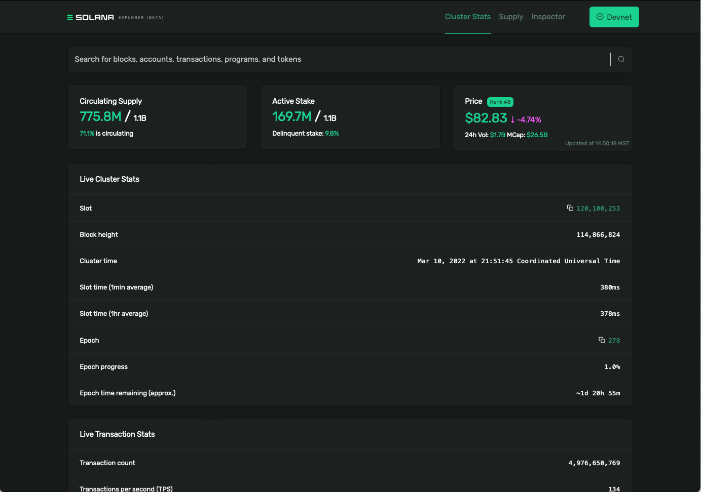
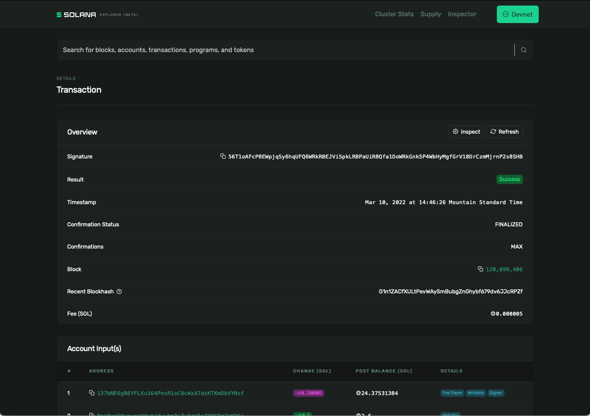
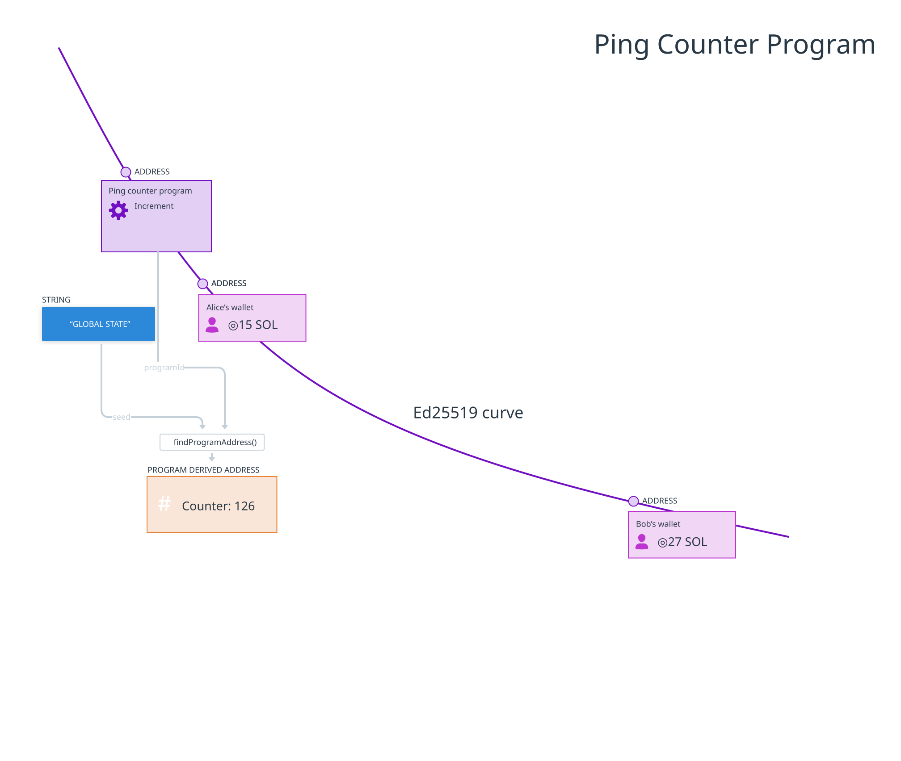
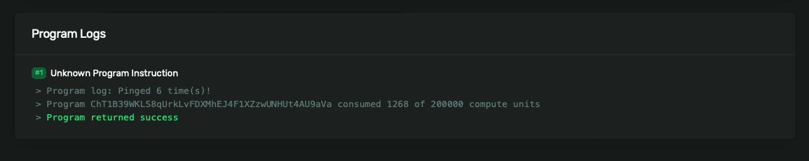

| 目标                        |           实验           |
| --------------------------- | :----------------------: |
| 1. 为自定义链上程序创建交易 | 为自定义链上程序进行交易 |

# [使用自定义链上程序](https://www.soldev.app/course/intro-to-custom-on-chain-programs)

## 概述

- Solana 有多个可供使用的链上程序。使用这些程序的指令的时候，传入的数据需要满足程序自定义的格式。

## 课程内容

### 指令

在前面的章节中，我们使用了：

- `@solana/web3.js` 中 `SystemProgram.transfer()` 函数来创建和发送转账SOL的指令。
- 来自 `@solana/spl-token` 的 `mintTo()` 和 `transfer()`函数，用于向 Token program发出指令以铸造和转移代币
- `@metaplex-foundation/mpl-token-metadata@2 `中的 `createCreateMetadataAccountV3Instruction()` 函数向 Metaplex 发出指令以创建代币元数据。

但是，在使用其他程序时，您需要使用 `@solana/web3.js` 手动创建指令，你可以使用 `TransactionInstruction` 构造函数创建指令：

```typescript
const instruction = new TransactionInstruction({
  programId: PublicKey;
  keys: [ 
    {
      pubkey: Pubkey,
      isSigner: boolean,
      isWritable: boolean,
    },
  ],
  data?: Buffer;
});
```

`TransactionInstruction()` 包含3个字段：

1. `programId` 字段比较容易理解：它是程序的公钥（也称为"地址"或"程序ID"）。
2. `keys` 是一个账户数组，指定了这些账户将如何在交易中使用。你需要了解你调用的程序行为，确保在数组中提供所有必要的账户。每个账户包含：
   - `pubkey` - 账户的公钥
   - `isSigner` - 一个布尔值，表示该账户是否是交易的签署者
   - `isWritable` - 一个布尔值，表示在交易执行期间是否会向该账户写入数据
3. 一个可选的 `Buffer`，包含要传递给程序的数据。我们暂时会忽略`data`字段，但会在未来的课程中重新讨论它。

创建指令后，我们将其添加到交易中，发送到我们的 RPC 进行处理和确认，然后查看交易签名。

```typescript
const transaction = new web3.Transaction().add(instruction)

const signature = await web3.sendAndConfirmTransaction(
  connection,
  transaction,
  [payer],
);

console.log(`✅ Success! Transaction signature is: ${signature}`);
```

### Solana 浏览器



区块链上的所有交易都可以在 [Solana Explorer](http://explorer.solana.com) 上公开查看。例如，您可以获取上例中 `sendAndConfirmTransaction()` 返回的签名，在 Solana Explorer 中搜索该签名，然后查看：

- 交易时什么时候发生
- 它包含在哪个区块中
- 交易费
- 还有更多！



## 实验 

**为 ping 计数器程序写交易**

我们将创建一个脚本来 ping 一个链上程序，每次 ping 时都会使计数器加一。该程序存在于 Solana Devnet 上，地址为 `ChT1B39WKLS8qUrkLvFDXMhEJ4F1XZzwUNHUt4AU9aVa`（program）。该程序将其计数的数据存储在地址为 `Ah9K7dQ8EHaZqcAsgBW8w37yN2eAy3koFmUn4x3CJtod` 的帐户（account）中



### 1. 基础脚手架

我们首先使用在[介绍写入数据](./intro-to-writing-data.md)的文件夹和 `.env` 文件。

创建一个名为 `send-ping-transaction.ts` 的文件：

```typescript
import * as web3 from "@solana/web3.js";
import "dotenv/config"
import { getKeypairFromEnvironment, airdropIfRequired } from "@solana-developers/helpers";

const payer = getKeypairFromEnvironment('SECRET_KEY')
const connection = new web3.Connection(web3.clusterApiUrl('devnet'))

const newBalance = await airdropIfRequired(
  connection,
  payer.publicKey,
  1 * web3.LAMPORTS_PER_SOL,
  0.5 * web3.LAMPORTS_PER_SOL,
);
```

如果需要，这将连接到 Solana 并空投一些 Lamports。

### 2. Ping 程序

现在我们来谈谈 Ping 程序！为此，我们需要：

1. 创建交易
2. 创建指令
3. 添加指令到交易中
4. 发送交易。

记住，这里最具挑战性的部分是在指令中包含正确的信息。我们知道我们要调用的程序的地址。我们还知道该程序会向一个单独的账户写入数据，我们也有这个账户的地址。让我们在文件顶部添加这两个地址的字符串版本作为常量：

```typescript
const PING_PROGRAM_ADDRESS = new web3.PublicKey('ChT1B39WKLS8qUrkLvFDXMhEJ4F1XZzwUNHUt4AU9aVa')
const PING_PROGRAM_DATA_ADDRESS =  new web3.PublicKey('Ah9K7dQ8EHaZqcAsgBW8w37yN2eAy3koFmUn4x3CJtod')
```

现在让我们创建一个新交易，然后为程序帐户初始化一个 `PublicKey`，并为数据帐户初始化另一个。

```typescript
const transaction = new web3.Transaction()
const programId = new web3.PublicKey(PING_PROGRAM_ADDRESS)
const pingProgramDataId = new web3.PublicKey(PING_PROGRAM_DATA_ADDRESS)
```

接下来，让我们创建指令。请记住，该指令需要包含 Ping 程序的公钥，还需要包含一个数组 `kyes`，其中包含将读取或写入的所有帐户。在此示例程序中，仅需要上面引用的数据帐户。

```typescript
const transaction = new web3.Transaction()
const programId = new web3.PublicKey(PING_PROGRAM_ADDRESS)
const pingProgramDataId = new web3.PublicKey(PING_PROGRAM_DATA_ADDRESS)

const instruction = new web3.TransactionInstruction({
  keys: [
    {
      pubkey: pingProgramDataId,
      isSigner: false,
      isWritable: true
    },
  ],
  programId
})
```

接下来，让我们将指令添加到我们创建的交易中。然后，通过传入connection、transaction 和 payer 来调用 `sendAndConfirmTransaction()`。最后，让我们 `log` 该函数调用的结果，以便我们可以在 Solana Explorer 上查找它。

```typescript
transaction.add(instruction)

const signature = await web3.sendAndConfirmTransaction(
  connection,
  transaction,
  [payer]
)

console.log(`✅ Transaction completed! Signature is ${signature}`)
```

### 3. 运行 ping 客户端并检查 Solana 浏览器

现在使用以下命令运行代码：

```bash
npx esrun send-ping-transaction.ts
```

这可能需要一两分钟，但您应该会看到一个长字符串打印到控制台，如下所示：

```
✅ Transaction completed! Signature is 55S47uwMJprFMLhRSewkoUuzUs5V6BpNfRx21MpngRUQG3AswCzCSxvQmS3WEPWDJM7bhHm3bYBrqRshj672cUSG
```

复制交易签名。打开浏览器并转到 [https://explorer.solana.com/?cluster=devnet](https://explorer.solana.com/?cluster=devnet)（URL 末尾的查询参数将确保您将在 Devnet 而不是 Mainnet 上查找交易）。将签名粘贴到 Solana Devnet 浏览器顶部的搜索栏中，然后按 Enter 键。您应该看到有关交易的所有详细信息。如果您一直滚动到底部，那么您将看到 `Program Logs`，其中显示程序已被 ping 的次数，包括您的 ping。

 

滚动浏览器并查看您所看到的内容：

- **Account Input(s)** 将包括：
  - 您 `Fee Payer` 地址，将被扣除5000 lamports用于交易
  - ping 程序的程序地址 `Ah9K7dQ8EHaZqcAsgBW8w37yN2eAy3koFmUn4x3CJtod`
  - ping 程序的数据地址 `ChT1B39WKLS8qUrkLvFDXMhEJ4F1XZzwUNHUt4AU9aVa`
- **Instructions** 部分将包含一个没有数据的单一指令 - ping程序是一个非常简单的程序，所以它不需要任何数据。
- **Program Instruction Logs** 显示来自 ping 程序的日志。

如果您希望将来能够更轻松地在 Solana Explorer 中查看交易，只需将 `console.log` 更改为以下内容即可：

```typescript
console.log(`You can view your transaction on Solana Explorer at:\nhttps://explorer.solana.com/tx/${signature}?cluster=devnet`)
```

就像这样，您可以在 Solana 网络上调用程序并在链上写入数据！

在接下来的几节课程中，您将学习如何

1. 从浏览器安全地发送交易，而不是通过运行脚本
2. 将自定义数据添加到您的指令中
3. 反序列化链上数据

## 挑战

继续从头开始创建一个脚本，该脚本将允许您将 SOL 从 Devnet 上的一个帐户转移到另一个帐户。请务必打印出交易签名，以便您可以在 Solana Explorer 上查看它。

如果您遇到困难，请随时查看[解决方案代码](https://github.com/Unboxed-Software/solana-ping-client)。


## 完成实验了吗？

将您的代码推送到 GitHub 并[告诉我们您对本课程的看法](https://form.typeform.com/to/IPH0UGz7#answers-lesson=e969d07e-ae85-48c3-976f-261a22f02e52)！

## 注意

1. `dotenv`和 `LAMPORTS_PER_SOL` -> `web3. LAMPORTS_PER_SOL`
